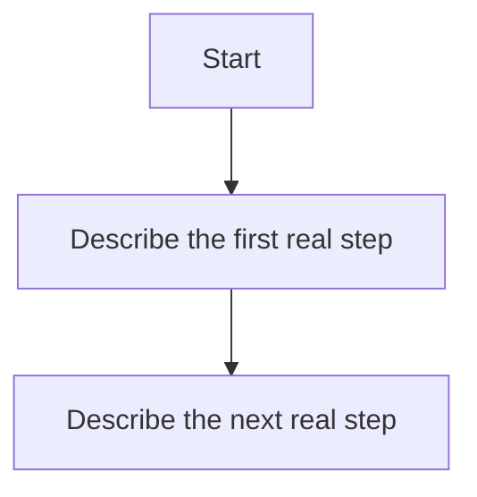

# Workflow

Describe only workflows that are already real.
If a control path is unresolved, record the gap in `04_task.md` and fill it before dispatch or implementation depends on that workflow slot.

Boundary:
Own runtime flow, ownership boundaries, triggers, actors, and outputs here.
Prefer an ordered function/layer model when the project has multiple runtime responsibilities.
Do not restate broad scope, dependency inventory, current task board state, or durable decision rationale.
Keep acceptance notes short here and use `03_acceptance.md` as the canonical acceptance surface.

Do not leave this file as a shell of unresolved headings once the project has entered real design, dispatch, or restructuring work.
Define the runtime shape here, and route any still-open questions into explicit task or decision follow-up.

## Purpose

Describe the runtime/workflow definition that the project should follow now.

## Target Runtime Layers

- List the ordered runtime layers or function groups.

## Operating Principles

- List the rules that govern ownership, handoff, and control flow.

---

## Function 1, rename to the actual function name before dispatch

### Purpose

Describe what this function is responsible for.

### Trigger Conditions

Current triggers:

- Record the current live trigger(s).

Target runtime triggers:

- Record the intended steady-state trigger(s).

### Main Owner

- Record the canonical owner path(s) or module boundary for this function.

### Main Outputs

- Record the outputs this function produces for the rest of the system.

### Workflow

1. Record the ordered steps this function follows.

### Flow

---

## Function 2, rename to the actual function name before dispatch

### Purpose

Describe what this function is responsible for.

### Trigger Conditions

Current triggers:

- Record the current live trigger(s).

Target runtime triggers:

- Record the intended steady-state trigger(s).

### Main Owner

- Record the canonical owner path(s) or module boundary for this function.

### Main Outputs

- Record the outputs this function produces for the rest of the system.

### Workflow

1. Record the ordered steps this function follows.

### Flow

---

## Cross-Function Operating Pattern

Describe how the functions interact end-to-end, including the key handoff rules.
